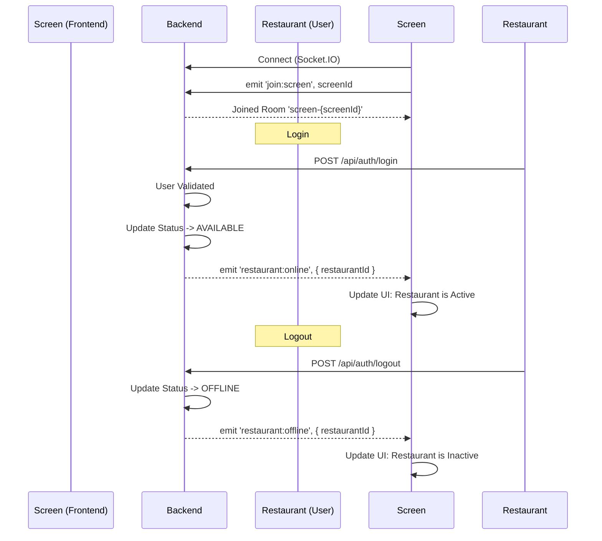

# Socket.IO Event Cycle for Frontend Implementation

This guide outlines the lifecycle of socket events for implementing real-time restaurant status updates on the Screen (Kiosk) frontend.

## 1. Connection Phase

**Action**: Connect to the socket server.

- **URL**: `http://localhost:3010` (or your backend URL)
- **Transport**: Websockets preferred.

```javascript
import { io } from "socket.io-client";

const socket = io("http://localhost:3010", {
  transports: ["websocket"],
  autoConnect: true,
});
```

## 2. Join Room Phase

**Action**: After connection, the screen **MUST** join its specific room identified by its `screenId`.

- **Event Name**: `join:screen`
- **Payload**: `screenId` (string)

```javascript
// Example using the screen ID: 73b261a5-f789-488c-9502-87fd0cbcf863
socket.on("connect", () => {
  console.log("Connected to socket server");

  // Replace with actual Screen ID from your auth/config
  const myScreenId = "73b261a5-f789-488c-9502-87fd0cbcf863";

  socket.emit("join:screen", myScreenId);
});
```

## 3. Listen for Status Updates

**Action**: Listen for events triggered when a restaurant assigned to this screen logs in or out.

### Event: Restaurant Online

- **Trigger**: Restaurant User logs in via `/api/auth/login`.
- **Event Name**: `restaurant:online`
- **Payload**:
  ```json
  {
    "restaurantId": "eddb8670-55f0-4d2b-be28-719c09b4c203"
  }
  ```
- **Description**: The backend automatically sets the restaurant status to `AVAILABLE` (isActive: true).
- **Frontend Action**: Update UI to show this restaurant is now **ACTIVE** / **AVAILABLE**.

```javascript
socket.on("restaurant:online", (data) => {
  console.log("Restaurant is Online:", data.restaurantId);
  // specific logic to update your state/UI
  updateRestaurantStatus(data.restaurantId, "AVAILABLE");
});
```

### Event: Restaurant Offline

- **Trigger**: Restaurant User logs out via `/api/auth/logout`.
- **Event Name**: `restaurant:offline`
- **Payload**:
  ```json
  {
    "restaurantId": "eddb8670-55f0-4d2b-be28-719c09b4c203"
  }
  ```
- **Description**: The backend automatically sets the restaurant status to `OFFLINE`.
- **Frontend Action**: Update UI to show this restaurant is now **INACTIVE** / **OFFLINE**.

```javascript
socket.on("restaurant:offline", (data) => {
  console.log("Restaurant is Offline:", data.restaurantId);
  // specific logic to update your state/UI
  updateRestaurantStatus(data.restaurantId, "OFFLINE");
});
```

## Summary Diagram


